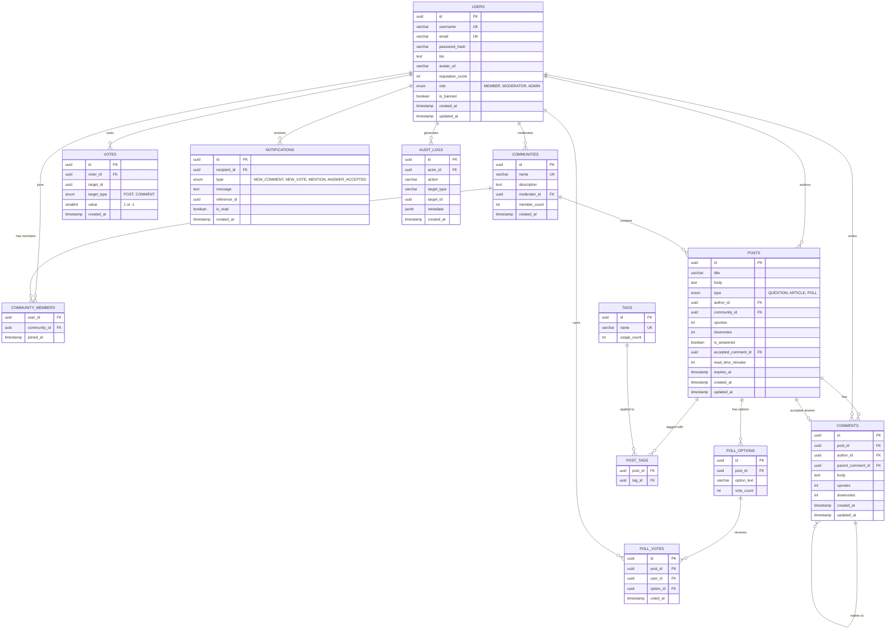

# ER Diagram – DevCircle

## Overview

This diagram shows all database tables, their columns, primary/foreign keys, and the relationships between them.
Designed for **PostgreSQL** with Prisma ORM.

---

## Diagram

---

## Table Notes

| Table             | Purpose                                                              |
|-------------------|----------------------------------------------------------------------|
| USERS             | Core user accounts with role-based access                           |
| COMMUNITIES       | Topic-based groups; each has one moderator                          |
| COMMUNITY_MEMBERS | Junction table for many-to-many User ↔ Community membership        |
| POSTS             | Polymorphic post table; `type` column differentiates subtypes       |
| POLL_OPTIONS      | Options belonging to a POLL type post                               |
| POLL_VOTES        | Tracks which user voted for which poll option                       |
| TAGS              | Flat tag list; linked to posts via POST_TAGS junction table         |
| POST_TAGS         | Junction table for many-to-many Post ↔ Tag                         |
| COMMENTS          | Comments and nested replies (self-referencing via parent_comment_id)|
| VOTES             | Generic vote table for both posts and comments (polymorphic FK)     |
| NOTIFICATIONS     | In-app notification records per user                               |
| AUDIT_LOGS        | Admin-visible log of all moderation and admin actions               |

## Constraints & Indexes

- `VOTES(voter_id, target_id, target_type)` — UNIQUE constraint to prevent duplicate votes
- `POLL_VOTES(post_id, user_id)` — UNIQUE constraint to prevent double poll voting
- `POSTS(community_id)`, `POSTS(author_id)`, `COMMENTS(post_id)` — indexed for fast feed queries
- `NOTIFICATIONS(recipient_id, is_read)` — indexed for unread notification lookups
