# Class Diagram – DevCircle

## Overview

The class diagram captures the major domain classes, their attributes, methods, and relationships.
It demonstrates OOP principles: **inheritance** (User roles, Post subtypes), **polymorphism** (Post.render(), FeedStrategy.rank()),
**encapsulation** (private fields with public methods), and **abstraction** (abstract base classes).

---

## Diagram

```mermaid
classDiagram

    %% ── User Hierarchy (Inheritance) ──────────────────────────────
    class User {
        +String id
        +String username
        +String email
        -String passwordHash
        +String bio
        +String avatarUrl
        +int reputationScore
        +String role
        +Date createdAt
        +register(email, password) User
        +login(email, password) String
        +updateProfile(dto) void
        +getReputation() int
    }

    class Member {
        +createPost(dto) Post
        +comment(postId, body) Comment
        +vote(targetId, type, value) Vote
        +joinCommunity(communityId) void
        +leaveCommunity(communityId) void
        +getNotifications() Notification[]
    }

    class Moderator {
        +String communityId
        +deletePost(postId) void
        +deleteComment(commentId) void
        +banUserFromCommunity(userId) void
        +updateCommunitySettings(dto) void
    }

    class Admin {
        +banUser(userId) void
        +unbanUser(userId) void
        +deleteCommunity(communityId) void
        +getAuditLogs() AuditLog[]
    }

    User <|-- Member
    Member <|-- Moderator
    Moderator <|-- Admin

    %% ── Post Hierarchy (Polymorphism + Factory) ───────────────────
    class Post {
        <<abstract>>
        +String id
        +String title
        +String body
        +String type
        +String authorId
        +String communityId
        +int upvotes
        +int downvotes
        +Date createdAt
        +Date updatedAt
        +getVoteScore() int
        +render()* String
        +validate()* boolean
    }

    class QuestionPost {
        +boolean isAnswered
        +String acceptedCommentId
        +markAsAnswered(commentId) void
        +render() String
        +validate() boolean
    }

    class ArticlePost {
        +String markdownContent
        +int readTimeMinutes
        +render() String
        +validate() boolean
    }

    class PollPost {
        +String[] options
        +Map~String,int~ voteCounts
        +Date expiresAt
        +castPollVote(userId, option) void
        +getResults() Map
        +render() String
        +validate() boolean
    }

    Post <|-- QuestionPost
    Post <|-- ArticlePost
    Post <|-- PollPost

    %% ── Factory ───────────────────────────────────────────────────
    class PostFactory {
        +create(type, dto) Post
    }
    PostFactory ..> Post : creates

    %% ── Comment ───────────────────────────────────────────────────
    class Comment {
        +String id
        +String postId
        +String authorId
        +String parentCommentId
        +String body
        +int upvotes
        +int downvotes
        +Date createdAt
        +getVoteScore() int
    }

    Post "1" --> "0..*" Comment : has
    Member "1" --> "0..*" Comment : writes

    %% ── Vote ──────────────────────────────────────────────────────
    class Vote {
        +String id
        +String voterId
        +String targetId
        +String targetType
        +int value
        +Date createdAt
    }

    Member "1" --> "0..*" Vote : casts
    Vote --> Post : targets
    Vote --> Comment : targets

    %% ── Community ─────────────────────────────────────────────────
    class Community {
        +String id
        +String name
        +String description
        +String moderatorId
        +int memberCount
        +Date createdAt
        +addMember(userId) void
        +removeMember(userId) void
    }

    Community "1" --> "0..*" Post : contains
    Member "0..*" --> "0..*" Community : joins

    %% ── Tag ───────────────────────────────────────────────────────
    class Tag {
        +String id
        +String name
        +int usageCount
    }

    Post "0..*" --> "0..*" Tag : tagged with

    %% ── Notification ──────────────────────────────────────────────
    class Notification {
        +String id
        +String recipientId
        +String type
        +String message
        +String referenceId
        +boolean isRead
        +Date createdAt
        +markAsRead() void
    }

    Member "1" --> "0..*" Notification : receives

    %% ── Observer Pattern ──────────────────────────────────────────
    class EventBus {
        <<singleton>>
        -Map listeners
        +on(event, handler) void
        +emit(event, payload) void
        +off(event, handler) void
    }

    class NotificationObserver {
        +handle(event, payload) void
    }

    EventBus --> NotificationObserver : notifies

    %% ── Strategy Pattern (Feed Ranking) ───────────────────────────
    class FeedStrategy {
        <<interface>>
        +rank(posts) Post[]
    }

    class ChronologicalStrategy {
        +rank(posts) Post[]
    }

    class TrendingStrategy {
        +rank(posts) Post[]
    }

    class TopVotedStrategy {
        +rank(posts) Post[]
    }

    FeedStrategy <|.. ChronologicalStrategy
    FeedStrategy <|.. TrendingStrategy
    FeedStrategy <|.. TopVotedStrategy

    class FeedService {
        -FeedStrategy strategy
        +setStrategy(strategy) void
        +getFeed(userId, filters) Post[]
    }

    FeedService --> FeedStrategy : uses

    %% ── Repository Interfaces ─────────────────────────────────────
    class PostRepository {
        <<interface>>
        +findById(id) Post
        +findByCommunity(communityId) Post[]
        +save(post) Post
        +delete(id) void
    }

    class UserRepository {
        <<interface>>
        +findByEmail(email) User
        +findById(id) User
        +save(user) User
        +updateReputation(userId, delta) void
    }

    class NotificationRepository {
        <<interface>>
        +save(notification) Notification
        +findByRecipient(userId, unread) Notification[]
        +markRead(id) void
    }
```

---

## OOP Principles Applied

| Principle      | Where Applied                                                    |
|----------------|------------------------------------------------------------------|
| Inheritance    | User → Member → Moderator → Admin; Post → Question/Article/Poll |
| Polymorphism   | Post.render() and validate() overridden in each subclass         |
| Encapsulation  | passwordHash is private; exposed only through login()            |
| Abstraction    | Post is abstract; FeedStrategy is an interface                   |
