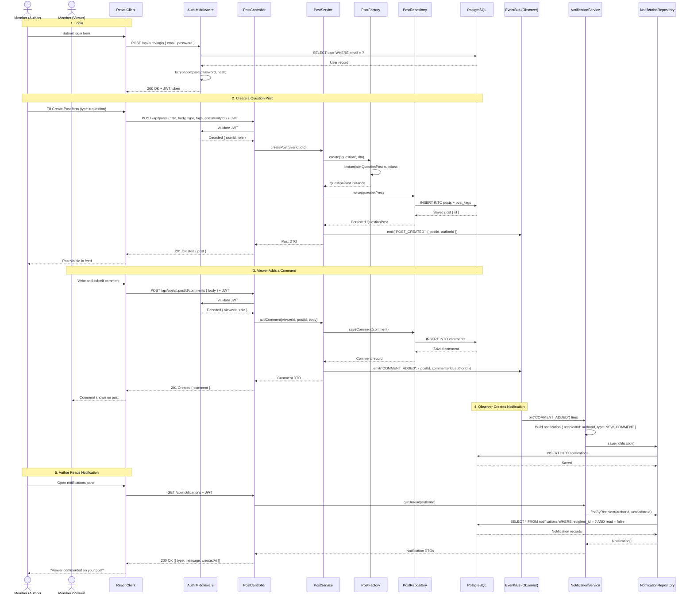

# Sequence Diagram – DevCircle

## Main Flow: User Creates a Post and Receives a Notification

This sequence covers the most complete end-to-end flow in the system:
a logged-in Member creates a Question post, another Member comments on it,
and the original author receives a notification — demonstrating Auth, Factory, Repository, and Observer patterns in one flow.

---

## Diagram

---

## Flow Summary

| Step | Description                          | Pattern / Principle   |
|------|--------------------------------------|-----------------------|
| 1    | JWT login and token verification     | Auth Middleware       |
| 2    | Post creation with type dispatch     | Factory Pattern       |
| 3    | Data persistence through repository  | Repository Pattern    |
| 4    | Event emitted after business logic   | Observer Pattern      |
| 5    | Notification created asynchronously  | Observer / Service    |
| 6    | Author retrieves unread notifications| Repository Pattern    |
