# Use Case Diagram – DevCircle

## Actors

| Actor     | Description                                              |
|-----------|----------------------------------------------------------|
| Guest     | Unauthenticated visitor — can browse only               |
| Member    | Registered and logged-in user                           |
| Moderator | Member with elevated rights over a specific community   |
| Admin     | Platform-wide control over users and communities        |
| System    | Automated system actions (notifications, feed ranking)  |

---

## Diagram

```mermaid
flowchart TD
    Guest([Guest])
    Member([Member])
    Moderator([Moderator])
    Admin([Admin])
    System([System])

    subgraph Authentication
        UC1[Register]
        UC2[Login]
        UC3[Logout]
    end

    subgraph Content
        UC4[Browse Posts and Feed]
        UC5[Search Posts and Tags]
        UC6[Create Post - Question or Article or Poll]
        UC7[Edit or Delete Own Post]
        UC8[Comment on Post]
        UC9[Reply to Comment]
        UC10[Vote on Post or Comment]
        UC11[Mark Answer as Accepted]
    end

    subgraph Communities
        UC12[View Communities]
        UC13[Create Community]
        UC14[Join or Leave Community]
        UC15[Manage Community Settings]
    end

    subgraph Tags
        UC16[Tag a Post]
        UC17[Browse by Tag]
    end

    subgraph Notifications
        UC18[View Notifications]
        UC19[Send Notification - System Triggered]
    end

    subgraph Moderation
        UC20[Delete Any Post in Community]
        UC21[Delete Any Comment in Community]
        UC22[Ban User from Community]
    end

    subgraph Administration
        UC23[Ban or Unban User Platform-wide]
        UC24[Delete Any Community]
        UC25[View Audit Logs]
    end

    Guest --> UC1
    Guest --> UC2
    Guest --> UC4
    Guest --> UC5
    Guest --> UC12
    Guest --> UC17

    Member --> UC3
    Member --> UC6
    Member --> UC7
    Member --> UC8
    Member --> UC9
    Member --> UC10
    Member --> UC11
    Member --> UC13
    Member --> UC14
    Member --> UC16
    Member --> UC18

    Moderator -->|extends| Member
    Moderator --> UC15
    Moderator --> UC20
    Moderator --> UC21
    Moderator --> UC22

    Admin -->|extends| Moderator
    Admin --> UC23
    Admin --> UC24
    Admin --> UC25

    System --> UC19
```

---

## Key Use Case Descriptions

### UC6 – Create Post
- **Actor**: Member
- **Precondition**: User is logged in and has joined a community
- **Main Flow**: User selects post type (Question / Article / Poll) → fills in title, body, tags → submits → System creates the correct post subtype via Factory Pattern → post appears in the community feed
- **Alternate Flow**: Validation fails → error message returned

### UC10 – Vote on Post or Comment
- **Actor**: Member
- **Precondition**: User is logged in and has not already voted on this item
- **Main Flow**: User clicks upvote/downvote → vote recorded → author's reputation updated → duplicate vote enforced
- **Alternate Flow**: Same vote again → vote is toggled off (removed)

### UC19 – Send Notification (System / Observer)
- **Actor**: System
- **Trigger**: A post receives a comment, a vote is cast, or a user is mentioned
- **Main Flow**: Observer detects event → Notification service creates in-app notification → stored in DB → surfaced to recipient on next request
